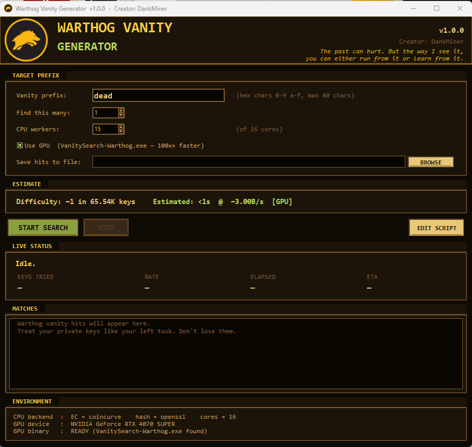

# Warthog Vanity Generator

<p align="center">
  
</p>

<p align="center">
  <em>Generate Warthog (WART) addresses with a chosen hex prefix.</em><br/>
  <strong>v1.0.0 — Creator: DankMiner</strong>
</p>

<p align="center">
  
  
  
  
</p>

<p align="center">
  
</p>

---

## What this is

A desktop tool that grinds Warthog private keys until one produces an
address that starts with a chosen hex prefix (e.g. `dead`, `beef`,
`deadbeef`). It uses your CPU by default and your CUDA GPU if you
build the included `VanitySearch-Warthog.exe`. The found private keys
drop straight into your Warthog wallet — open it, **Add wallet → Restore
with private key**, paste the hex, done.

## Why hex?

Warthog addresses are **48 lowercase hex characters**: a 20-byte
`HASH160 = RIPEMD160(SHA256(compressed_pubkey))` payload followed by a
4-byte SHA-256 checksum. There is no version byte, no Base58, no
Bech32, no HRP. See `src/shared/src/crypto/address.cpp:5-12` in the
[upstream Warthog source][upstream]. That makes the prefix space the
**full hex alphabet at every position**: 16 reachable values per
character.

| Prefix length | Expected attempts | RTX 4070 SUPER (~3 Gkey/s) |
|--:|--:|--:|
| 4  | 65,536 | < 1 s |
| 5  | ~1.05 M | < 1 s |
| 6  | ~16.8 M | < 1 s |
| 7  | ~268 M | < 1 s |
| 8  | ~4.3 B | ~1.4 s |
| 9  | ~68.7 B | ~23 s |
| 10 | ~1.1 T | ~6 min |
| 11 | ~17.6 T | ~1.6 h |
| 12 | ~281 T | ~1 day |

Hex prefixes are case-insensitive (canonical Warthog form is always
lowercase, and the GUI lowercases your input automatically).

## Install

1. Install Python 3.11 or 3.12 from [python.org][py] (recommended for
   the fast `coincurve` wheel). Python 3.13/3.14 also work but fall
   back to `ecdsa`, which is ~30× slower on the CPU path. The GPU path
   is unaffected.
2. Run `install.bat` once. It installs `ecdsa`, `pycryptodome`,
   `Pillow`, and tries `coincurve`.
3. (Optional, big speedup) Build the GPU binary: see "Build
   `VanitySearch-Warthog.exe`" below.

## Run

- **GUI**: double-click `Warthog-Vanity.bat`. No console window.
- **CLI**: `warthog_cli.bat dank` or `py -3 warthog_cli.py dank`.

```text
> warthog_cli.bat dank --no-banner
  EC backend    : coincurve
  Hash backend  : openssl
  GPU           : NVIDIA GeForce RTX 4070 SUPER
  Target prefix : dank
  Workers       : 15
  Want matches  : 1
  Difficulty    : ~1 in 65.54K keys
  Encoding      : 48 hex chars  (20-byte payload + 4-byte SHA-256 checksum)
  ...
  [HIT 1/1]  in 5s after ~0 keys
    Address    : dank<...>
    Private key: <64 hex chars>
    Pubkey     : <66 hex chars>
    Import     : paste Private hex into the Warthog wallet -> Add wallet -> Restore with private key
```

## Prefix rules

- **Allowed chars**: `0-9`, `a-f`. Uppercase input is silently
  lowercased.
- **Length**: 1-40 chars on the CPU path; 4-40 on the GPU binary
  (the GUI auto-routes shorter prefixes to CPU since they finish in
  milliseconds anyway).
- **Reachability**: every position is fully reachable (16 values).
  There is no version byte that pins the first character, and no HRP
  that could collide with a parser short-circuit (unlike CapStash —
  see "Lessons learned" below).
- **Last 8 chars are not controllable**: they are
  `hex(SHA-256(payload)[0:4])`, deterministic from the payload. For
  prefix vanity you can target the first 40 chars at most.

## Import the key into your Warthog wallet

You only need the **Private hex** line from a hit (64 lowercase hex
characters). Copy it once and use either path below.

### Option A — GUI wallet *(recommended)*

1. Open the Warthog wallet on Windows.
2. Click **Add wallet**.
3. Choose **Restore with private key**.
4. Set a password for the new wallet.
5. Paste the 64-char hex private key.
6. Confirm — the wallet derives the address and you're done. Verify the
   address matches the one the vanity generator showed you before
   sending any funds.

### Option B — `wart-wallet` CLI *(advanced)*

The reference command-line wallet stores keys as a JSON file:

```text
wart-wallet --restore <64-hex-char-private-key> -f my-vanity-wallet.json
```

The wallet writes a `my-vanity-wallet.json` like:

```json
{
 "privateKey": "<64 hex chars>",
 "publicKey":  "<66 hex chars>",
 "address":    "<48 hex chars — your vanity address>"
}
```

Subsequent commands (`--address`, `--balance`, `--send`) operate on
this file. There is no `importprivkey` RPC, no descriptor-vs-legacy
distinction, no qt console quoting, no WIF format — just the one
restore command.

## Build `VanitySearch-Warthog.exe`

You need:

- Visual Studio 2022 Community with the **Desktop development with
  C++** workload (toolset `v143`).
- CUDA Toolkit 12.8 (`nvcc.exe` on `PATH`, or installed at the
  default location `C:\Program Files\NVIDIA GPU Computing Toolkit\
  CUDA\v12.8`).

Then:

```text
cd VanitySearch-Warthog
build.bat
```

`build.bat` calls `vcvars64.bat`, runs `msbuild VanitySearch.sln
/p:Configuration=Release /p:Platform=x64`, and copies the result up
one level as `VanitySearch-Warthog.exe`. Default targets: `sm_75`,
`sm_80`, `sm_86`, `sm_89` (Ada / RTX 40 series), and `sm_90`. Edit
`VanitySearch.vcxproj` (the `<CodeGeneration>` block) if you need a
different set.

The GUI auto-detects the binary on next launch.

## Layout

```
warthog-vanity-generator/
├── README.md
├── CHANGELOG.md
├── LICENSE                          (GPL-3.0 — bundle includes VanitySearch)
├── .gitignore
├── docs/screenshots/gui.png
├── Warthog-Vanity.bat               GUI launcher (uses pythonw, no console)
├── warthog_cli.bat                  CLI launcher
├── install.bat                      Python deps installer
├── install-gpu.bat                  Optional pyopencl
├── warthog_engine.py                Core: ECC + HASH160 + hex encoding + CPU MP worker
├── warthog_gui.py                   Tkinter GUI (Warthog "coal & gold" theme)
├── warthog_cli.py                   Command-line interface
├── warthog_gpu_runner.py            Drives the GPU binary, parses status
├── warthog_logo.png                 Header image
├── warthog_logo.ico                 Multi-res ICO for window/taskbar
├── VanitySearch-Warthog.exe         Prebuilt CUDA binary (after build.bat)
└── VanitySearch-Warthog/            Patched source + build.bat
```

## Lessons learned (notes from CapStash → Warthog)

| Lesson from CapStash | Status on Warthog |
|---|---|
| Bech32 HRP `cap` collided with P2PKH `Cap*` prefixes in the wallet's `DecodeDestination` short-circuit. | **Doesn't apply** — Warthog has no Bech32 / HRP. The address parser at [`address.cpp:19-31`][upstream-addr] is one straight-line code path. |
| `wart-wallet` qt console requires escaped quotes for JSON args. | **Doesn't apply** — `wart-wallet --restore <hex>` is a command-line tool, not a console RPC. |
| Descriptor vs legacy wallet distinction blocked `importprivkey`. | **Doesn't apply** — Warthog has one wallet format. |
| VanitySearch status `printf` ends in `\r` and gets fully buffered when stdout is piped. | Carried over: `fflush(stdout)` after the rate printf in `Vanity.cpp::Search()`. |
| Don't pass `-stop` to VanitySearch — it exits after the first hit, which breaks "Find this many = N". | Carried over: GPU runner counts hits and stops the subprocess externally. |
| Window taskbar shows `pythonw.exe` icon by default. | Carried over: `SetCurrentProcessExplicitAppUserModelID` + multi-res `.ico`. |
| Bitcoin-style `.vcxproj` references CUDA 11 / v141. | Already retargeted by CapStash to CUDA 12.8 / v143 / `sm_89`. |

## Troubleshooting

| Symptom | Fix |
|---|---|
| GUI launches with a console window | `Warthog-Vanity.bat` couldn't find `pythonw.exe`. Reinstall Python with the `tcl/tk` and "for all users" options ticked. |
| GUI starts but icon is a blank Python | The multi-res `.ico` is missing. Re-run `install.bat` or copy `warthog_logo.ico` from the source release. |
| CLI rate stays at 0/s | Workers haven't reported their first batch yet. Wait ~5s; this is normal for very-short prefixes that finish before the first stats flush. |
| GPU binary not detected | Build it (see above). The GUI looks for `VanitySearch-Warthog.exe` next to `warthog_gui.py`. |
| Difficulty / ETA seems wildly off | Estimates assume coincurve+OpenSSL on CPU and ~3 Gkey/s on GPU. Switch backends or measure your actual rate from the LIVE STATUS panel after 30 s. |
| Wallet reports "Invalid private key" on import | Make sure you copied the **64-char hex** value (the "Private hex" line from a hit), not the 48-char address. Both are hex but different lengths. |

## Credits

- Upstream Warthog implementation: Pumbaa, Timon & Rafiki — see
  [`warthog-network/Warthog`][upstream].
- VanitySearch: Jean-Luc Pons, GPL-3.0 — see
  [`JeanLucPons/VanitySearch`][vs].
- Patches & packaging: **DankMiner**.

[upstream]: https://github.com/warthog-network/Warthog
[upstream-addr]: https://github.com/warthog-network/Warthog/blob/master/src/shared/src/crypto/address.cpp
[vs]: https://github.com/JeanLucPons/VanitySearch
[py]: https://www.python.org/downloads/

> *The past can hurt. But the way I see it, you can either run from it or learn from it.* — Rafiki
